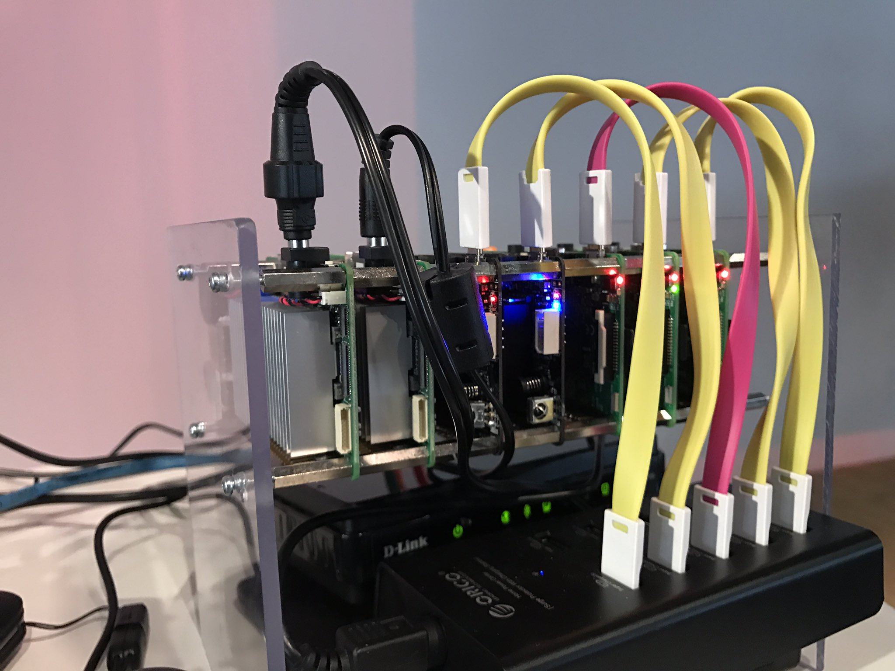
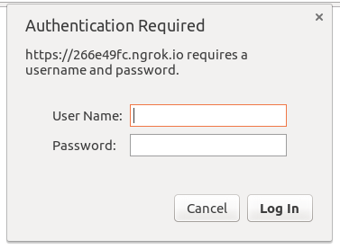
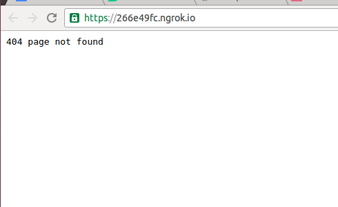
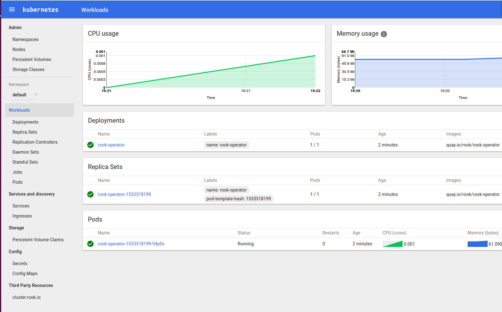
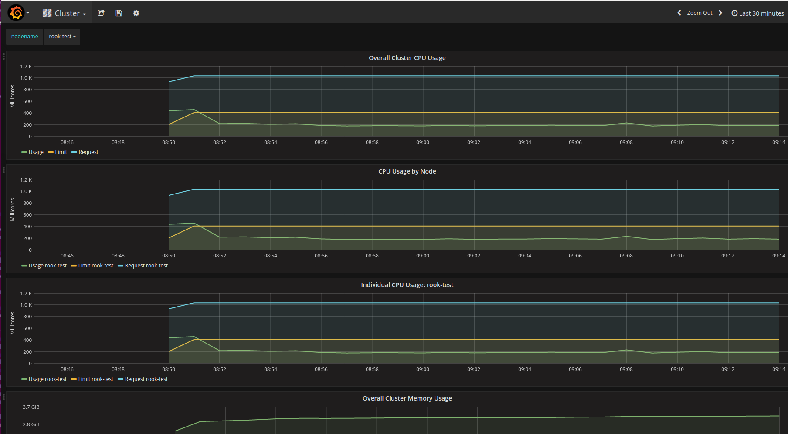
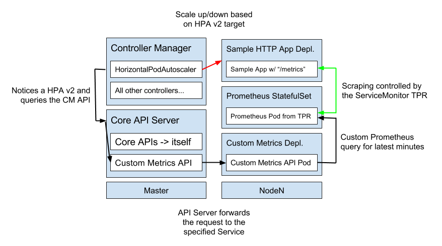

### Workshop:

## Building a multi-platform Kubernetes cluster on bare metal with `kubeadm`

Hi and welcome to this tutorial and demonstration of how to build a bare-metal Kubernetes cluster with kubeadm!

I'm one of the main kubeadm developers and very excited about bare metal as well, 
so I thought showing some of the things you can do with Kubernetes/kubeadm would be a great fit!

This workshop is a part of my talk at KubeCon Berlin: [Autoscaling a Multi-Platform Kubernetes Cluster Built with kubeadm [I] - Lucas Käldström - YouTube](https://youtu.be/ZdzKQwMjg2w)

My slides for the presentation are here: http://slides.com/lucask/kubecon-berlin

### Highlights

* Showcases what you can do on bare-metal, even behind a firewall with no public IP address
* Demonstrates usage of cutting-edge technologies like Persistent Storage running on-cluster, Autoscaling based on Custom Metrics and Aggregated API Servers

What's more, the Kubernetes yaml manifests included in this repository are multi-architecture and works on ARM, both 32- and 64-bit!

My own setup at home consists of this hardware:
 - 2x Up Board, 4 cores @ 1.44 GHz, 2 GB RAM, 1 GbE, 16 GB eMMc, amd64, [Link](http://up-shop.org/up-boards/2-up-board-2gb-16-gb-emmc-memory.html)
 - 2x Odroid C2, 4 cores @ 1.5 GHz, 2 GB RAM, 1 GbE, 16 GB eMMc, arm64, [Link](http://www.hardkernel.com/main/products/prdt_info.php)
 - 3x Raspberry Pi, 4 cores @ 1.2 GHz, 1 GB RAM, 100 MbE, 16 GB SD Card, arm/arm64, [Link](https://www.raspberrypi.org/products/raspberry-pi-3-model-b/)



So, no more smalltalk then, let's dive right in!

### Contents

This workshop is divided into these parts:

* Installing kubeadm on all the machines you want in your cluster
* Setting up your Kubernetes master
* Setting up the worker nodes
* Deploying the Pod networking layer
* Deploying the Dashboard and Heapster
* Deploying an Ingress Controller for exposing HTTP services
* Deploying a persistent storage layer on top of Kubernetes with Rook
* Deploying InfluxDB and Grafana for storing and visualizing CPU and memory metrics
* Deploying a extension API Server for extending the Kubernetes API
* Deploying the Prometheus Operator for monitoring Pods in the cluster
* Deploying a sample custom metrics API Server
* Deploying and autoscaling a sample node.js application based on custom metrics

### Installing kubeadm on all the machines you want in your cluster

> WARNING: This workshop uses alpha technologies in order to be on the edge and Kubernetes can't be upgraded.
> This means the features used and demonstrated here might work differently in v1.7 and backwards-compability isn't guaranteed in any way

**Note:** The first part that describes how to install kubeadm is just copied from the [official kubeadm documentation](https://kubernetes.io/docs/getting-started-guides/kubeadm/)

**Note:** It's expected that you have basic knowledge about how Kubernetes and kubeadm work, because quite advanced concepts are covered in this workshop.

**Note:** This guide has been tested on Ubuntu Xenial, Yakkety and Zesty

You can install kubeadm easily this way:

```bash
curl -s https://packages.cloud.google.com/apt/doc/apt-key.gpg | apt-key add -
cat <<EOF > /etc/apt/sources.list.d/kubernetes.list
deb http://apt.kubernetes.io/ kubernetes-xenial main
EOF
apt-get update
apt-get install -y docker.io kubeadm
```

You should do this on all machines you're planning to include in your cluster, and these commands are exactly the same regardless on which architecture you are on.

### Setting up your Kubernetes master

SSH into your master node, and switch to the `root` account of the machine or use `sudo` everywhere below.

As mentioned earlier, experimental features of different kinds will be used in this tutorial to show off the latest and greatest features in Kubernetes.

kubeadm for example, can take options from a configuration file in order to be customized easily.
But the API exposed right now is _not_ stable, and under heavy development. So this will definitely change (to the better) in time for v1.7.

The configuration file we'll use here looks like this in `kubeadm.yaml`:

```yaml
kind: MasterConfiguration
apiVersion: kubeadm.k8s.io/v1alpha1
controllerManagerExtraArgs:
  horizontal-pod-autoscaler-use-rest-clients: "true"
  horizontal-pod-autoscaler-sync-period: "10s"
  node-monitor-grace-period: "10s"
apiServerExtraArgs:
  runtime-config: "api/all=true"
kubernetesVersion: "stable-1.8"
```

A brief walkthrough what the statements mean:
 - `horizontal-pod-autoscaler-use-rest-clients: "true"` tells the controller manager to look for the [custom metrics API](https://github.com/kubernetes/community/blob/master/contributors/design-proposals/custom-metrics-api.md)

You can now go ahead and initialize the master node with this command (assuming you're `root`, append `sudo` if not):

```console
$ kubeadm init --config kubeadm.yaml
```

Make sure you got kubeadm v1.8.0-beta.1 or higher and docker 1.12.x.
In order to control your cluster securely, you need to specify the `KUBECONFIG` variable to `kubectl` knows where to look for the admin credentials.
Here is an example how to do it as a regular user.

```bash
sudo cp /etc/kubernetes/admin.conf $HOME/
sudo chown $(id -u):$(id -g) $HOME/admin.conf
export KUBECONFIG=$HOME/admin.conf
```

#### Make the `kube-proxy` DaemonSet multi-platform

Since `kube-proxy` runs in a DaemonSet, it will be scheduled on all nodes. By default, an image with the architecture that `kubeadm init` is run on
is used in the DaemonSet, so if you ran `kubeadm init` on an `arm64` image, the `kube-proxy` image with be `gcr.io/google_containers/kube-proxy-arm64`.

To make it possible to add nodes with other architectures we have to switch the image to a manifest list like this. First, make the DaemonSet, rolling-upgradeable
and then change the image to a manifest list.

```console
$ kubectl -n kube-system set image daemonset/kube-proxy kube-proxy=luxas/kube-proxy:v1.8.0-beta.1
```

With those two commands, `kube-proxy` will come up successfully on whatever node you bring to your cluster.

#### Deploying the Pod networking layer

The networking layer in Kubernetes is extensible, and you may pick the networking solution that fits you the best.
I've tested this with Weave Net, but it should work with any other compliant provider.

Here's how to use Weave Net as the networking provider the really easy way:

```console
$ kubectl apply -f https://git.io/weave-kube-1.6
```

**OR** you can run these two commands if you want to encrypt the communication between nodes:

```console
$ kubectl create secret -n kube-system generic weave-passwd --from-literal=weave-passwd=$(hexdump -n 16 -e '4/4 "%08x" 1 "\n"' /dev/random)
$ kubectl apply -n kube-system -f "https://cloud.weave.works/k8s/net?k8s-version=$(kubectl version | base64 | tr -d '\n')&password-secret=weave-passwd"
```

### Setting up the worker nodes

`kubeadm init` above will print out a `kubeadm join` command for you to paste for joining the other nodes in your cluster to the master.

**Note:** Make sure you join all nodes before you arch-taint the nodes (if you do)!

```console
$ kubeadm join --token <token> <master-ip>:<master-port>
```

#### Taints and tolerations

[`Taints and Tolerations`](https://github.com/kubernetes/community/blob/master/contributors/design-proposals/taint-toleration-dedicated.md)
is a concept of dedicated nodes. Simply put, if you taint a node with a key/value pair and the effect `NoSchedule`, it will reject all Pods
that don't have the same key/value set in the `Tolerations` field of the `PodSpec`.

By default, the master is tainted with the `node-role.kubernetes.io=""` key/value pair which will make it only allow the `kube-dns` Deployment,
the `kube-proxy` DaemonSet and most often the CNI network provider's DaemonSet, because they have the toleration.

In case you only have one node available for testing and want to run normal workloads on the master as well (allow all workloads on the master),
run this command:

```console
$ kubectl taint nodes --all node-role.kubernetes.io/master-
```

In order to make the default architecture `amd64`, and you know you might deploy workloads that aren't multi-platform, it's best to taint the
"special" nodes of an other architecture and explicitely tolerate ARM (32- and 64-bit) on the workloads that support it.

You can taint your arm and arm64 nodes with these commands:

```console
$ kubectl taint node <arm nodes> beta.kubernetes.io/arch=arm:NoSchedule
$ kubectl taint node <arm64 nodes> beta.kubernetes.io/arch=arm64:NoSchedule
```

### Deploying the Dashboard and Heapster

I really like visualizing the cluster resources in the [Kubernetes Dashboard](https://github.com/kubernetes/dashboard) (although I'm mostly a CLI guy).

You can install the dashboard with this command:

```console
$ curl -sSL https://git.io/kube-dashboard | sed "s|image:.*|image: luxas/kubernetes-dashboard:v1.6.3|" | kubectl apply -f -
serviceaccount "dashboard" created
clusterrolebinding "dashboard-admin" created
deployment "kubernetes-dashboard" created
service "kubernetes-dashboard" created
```

You probably want some monitoring as well, if you install [Heapster](https://github.com/kubernetes/heapster) you can easily keep track of the CPU and
memory usage in your cluster. Those stats will also be shown in the dashboard!

```console
$ kubectl apply -f demos/monitoring/heapster.yaml
serviceaccount "heapster" created
clusterrolebinding "heapster" created
deployment "heapster" created
service "heapster" created
```

You should now see some Services in the `kube-system` namespace:

```console
$ kubectl -n kube-system get svc
NAME                   CLUSTER-IP      EXTERNAL-IP   PORT(S)         AGE
heapster               10.104.142.79   <none>        80/TCP          5s
kube-dns               10.96.0.10      <none>        53/UDP,53/TCP   42s
kubernetes-dashboard   10.97.73.205    <none>        80/TCP          11s
```

After `heapster` is up and running (check with `kubectl -n kube-system get pods`), you should be able to see the 
CPU and memory usage of the nodes in the cluster and for individual Pods:

```console
$ kubectl top nodes
NAME        CPU(cores)   CPU%      MEMORY(bytes)   MEMORY%
test-node   131m         1%        9130Mi          30%
```

### Deploying an Ingress Controller for exposing HTTP services

Now that you have created the dashboard and heapster Deployments and Services, how can you access them?

One solution might be making your Services of the NodePort type, but that's not a good long-term solution.

Instead, there is the Ingress object in Kubernetes that let's you create rules for how Services in your cluster should be exposed to the world.
Before one can create Ingress rules, you need a Ingress Controller that watches for rules, applies them and forwards requests as specified.

One Ingress Controller provider is [Traefik](traefik.io), and I'm using that one here.

In this demo I go a step further. Normally in order to expose your app you have locally to the internet requires that one of your machines has a public Internet
address. We can workaround this very smoothly in a Kubernetes cluster by letting [Ngrok](ngrok.io) forward requests from a public subdomain of `ngrok.io` to the
Traefik Ingress Controller that's running in our cluster.

Using ngrok here is perfect for hybrid clusters where you have no control over the network you're connected to... you just have internet access.
Also, this method is can be used in nearly any environment and will behave the same. But for production deployments (which we aren't dealing with here),
you should of course expose a real loadbalancer node with a public IP.

```console
$ kubectl apply -f demos/loadbalancing/traefik-common.yaml
clusterrole "traefik-ingress-controller" created
serviceaccount "traefik-ingress-controller" created
clusterrolebinding "traefik-ingress-controller" created
configmap "traefik-cfg" created

$ kubectl apply -f demos/loadbalancing/traefik-ngrok.yaml
deployment "traefik-ingress-controller" created
service "traefik-ingress-controller" created
service "traefik-web" created
configmap "ngrok-cfg" created
deployment "ngrok" created
service "ngrok" created

$ curl -sSL $(kubectl -n kube-system get svc ngrok -o template --template "{{.spec.clusterIP}}")/api/tunnels | jq  ".tunnels[].public_url" | sed 's/"//g;/http:/d'
https://foobarxyz.ngrok.io
```

You can now try to access the ngrok URL that got outputted by the above command. It first ask you for a password, then return 404 due to the absence of Ingress
rules.





Let's change that by creating an Ingress rule!

#### Exposing the Dashboard via the Ingress Controller

We want to expose the dashboard to our newly-created public URL, under the `/dashboard` path.

That's easily achievable using this command:

```console
$ kubectl apply -f demos/dashboard/ingress.yaml
ingress "kubernetes-dashboard" created
```

The Traefik Ingress Controller is set up to require basic auth before one can access the services.

I've set the username to `kubernetes` and the password to `rocks!`. You can obviously change this if you want by editing the `traefik-common.yaml` before deploying
the Ingress Controller.

When you've signed in to `https://{ngrok url}/dashboard/` (note the `/` in the end, it's required), you'll see a dashboard like this:



### Deploying a persistent storage layer on top of Kubernetes with Rook

Stateless services are cool, but deploying stateful applications on your Kubernetes cluster is even more fun.

For that you need somewhere to store persistent data, and that's not easy to achieve on bare metal. [Rook](https://github.com/rook/rook) is a promising project
aiming to solve this by building a Kubernetes integration layer upon the battle-tested Ceph storage solution.

Rook is using `ThirdPartyResources` for knowing how to set up your storage solution, and has an [operator](https://github.com/rook/rook/tree/master/cmd/rook-operator)
that is listening for these TPRs.

Here is how to create a default Rook cluster by deploying the operator, a controller that will listen for PersistentVolumeClaims that need binding, a Rook Cluster
ThirdPartyResource and finally a StorageClass.

```console
$ kubectl apply -f https://raw.githubusercontent.com/rook/rook/release-0.5/cluster/examples/kubernetes/rook-operator.yaml
clusterrole "rook-operator" created
serviceaccount "rook-operator" created
clusterrolebinding "rook-operator" created
deployment "rook-operator" created

$ kubectl apply -f https://raw.githubusercontent.com/rook/rook/release-0.5/cluster/examples/kubernetes/rook-cluster.yaml
cluster "my-rook" created

$ kubectl apply -f https://raw.githubusercontent.com/rook/rook/release-0.5/cluster/examples/kubernetes/rook-storageclass.yaml
pool "replicapool" created
storageclass "rook-block" created

$ # Repeat this step for all namespaces you want to deploy PersistentVolumes with Rook in
$ kubectl get secret rook-rook-user -oyaml | sed "/resourceVer/d;/uid/d;/self/d;/creat/d;/namespace/d" | kubectl -n kube-system apply -f -
secret "rook-rook-user" created

$ # In order to make Rook the default Storage Provider by making the `rook-block` Storage Class the default, run this:
$ kubectl patch storageclass rook-block -p '{"metadata":{"annotations": {"storageclass.kubernetes.io/is-default-class": "true"}}}'
storageclass "rook-block" patched

$ apt-get update && apt-get install ceph-common -y
```

One limitation with v0.3.0 is that you can't control to which namespaces the rook authentication Secret should be deployed, so if you want to create
`PersistentVolumes` in an other namespace than `default`, run the above `kubectl` command.

### Deploying InfluxDB and Grafana for storing and visualizing CPU and memory metrics

Now that we have got persistent storage in our cluster, we can deploy some stateful services. For example, we can store monitoring data aggregated by Heapster
in an InfluxDB database and visualize that data with a Grafana dashboard.

You must do this if you want to gather CPU/memory data from Heapster for a longer time, by default heapster just saves data from the latest couple of minutes.

```console
$ kubectl apply -f demos/monitoring/influx-grafana.yaml
persistentvolumeclaim "grafana-pv-claim" created
persistentvolumeclaim "influxdb-pv-claim" created
deployment "monitoring-grafana" created
service "monitoring-grafana" created
deployment "monitoring-influxdb" created
service "monitoring-influxdb" created
ingress "monitoring-grafana" created
```

Note that an Ingress rule was created for Grafana automatically. You can access your Grafana instance at the `https://{ngrok url}/grafana/` URL.



### Sample API Server

The core API Server is great, but what about if you want to write your own, extended API server that contains more high-level features that build on top of Kubernetes
but still be able to control those high-level features from kubectl? This is now possible using the API Aggregation feature that will make it into beta in v1.7

First, let's check which API groups are available normally:

```console
$ kubectl api-versions
apiregistration.k8s.io/v1beta1
apps/v1beta1
authentication.k8s.io/v1
authentication.k8s.io/v1beta1
authorization.k8s.io/v1
authorization.k8s.io/v1beta1
autoscaling/v1
autoscaling/v2alpha1
batch/v1
batch/v2alpha1
certificates.k8s.io/v1beta1
extensions/v1beta1
policy/v1beta1
rbac.authorization.k8s.io/v1alpha1
rbac.authorization.k8s.io/v1beta1
rook.io/v1beta1
settings.k8s.io/v1alpha1
storage.k8s.io/v1
storage.k8s.io/v1beta1
v1
```

It's pretty straightforward to write your own API server now with the break-out of [`k8s.io/apiserver`](https://github.com/kubernetes/apiserver).
The `sig-api-machinery` team has also given us a sample implementation: [`k8s.io/sample-apiserver`](https://github.com/kubernetes/sample-apiserver).

The sample API Server called wardle, contains one API group: `wardle.k8s.io/v1alpha1` and one API resource in that group: `Flunder`
This guide shows how easy it will be to extend the Kubernetes API in the future.

The sample API Server saves its data to a separate etcd instance running in-cluster. Notice the PersistentVolume that is created for etcd for that purpose.
Note that in the future, the etcd Operator should probably be used for running etcd instead of running it manually like now.

```console
$ kubectl apply -f demos/sample-apiserver/wardle.yaml
namespace "wardle" created
persistentvolumeclaim "etcd-pv-claim" created
serviceaccount "apiserver" created
clusterrolebinding "wardle:system:auth-delegator" created
rolebinding "wardle-auth-reader" created
deployment "wardle-apiserver" created
service "api" created
apiservice "v1alpha1.wardle.k8s.io" created

$ kubectl get secret rook-rook-user -oyaml | sed "/resourceVer/d;/uid/d;/self/d;/creat/d;/namespace/d" | kubectl -n wardle apply -f -
secret "rook-rook-user" created
```

After a few minutes, when the extended API server is up and running, `kubectl` will auto-discover that API group and it will be possible to
create, list and delete Flunder objects just as any other API object.

```console
$ kubectl api-versions
apiregistration.k8s.io/v1beta1
apps/v1beta1
authentication.k8s.io/v1
authentication.k8s.io/v1beta1
authorization.k8s.io/v1
authorization.k8s.io/v1beta1
autoscaling/v1
autoscaling/v2alpha1
batch/v1
batch/v2alpha1
certificates.k8s.io/v1beta1
extensions/v1beta1
policy/v1beta1
rbac.authorization.k8s.io/v1alpha1
rbac.authorization.k8s.io/v1beta1
rook.io/v1beta1
settings.k8s.io/v1alpha1
storage.k8s.io/v1
storage.k8s.io/v1beta1
v1
***wardle.k8s.io/v1alpha1***

$ # There is no foobarbaz resource, but the flunders resource does now exist
$ kubectl get foobarbaz
the server doesn't have a resource type "foobarbaz"

$ kubectl get flunders
No resources found.

$ kubectl apply -f demos/sample-apiserver/my-flunder.yaml
flunder "my-first-flunder" created
```

If you want to make sure this is real, you can check the etcd database running in-cluster with this command:

```console
$ kubectl -n wardle exec -it $(kubectl -n wardle get po -l app=wardle-apiserver -otemplate --template "{{ (index .items 0).metadata.name}}") -c etcd /bin/sh -- -c "ETCDCTL_API=3 etcdctl get /registry/wardle.kubernetes.io/registry/wardle.kubernetes.io/wardle.k8s.io/flunders/my-first-flunder" | grep -v /registry/wardle | jq .
{
  "kind": "Flunder",
  "apiVersion": "wardle.k8s.io/v1alpha1",
  "metadata": {
    "name": "my-first-flunder",
    "uid": "bef75e16-2c5b-11e7-999c-1602732a5d02",
    "creationTimestamp": "2017-04-28T21:43:41Z",
    "labels": {
      "sample-label": "true"
    },
    "annotations": {
      "kubectl.kubernetes.io/last-applied-configuration": "{\"apiVersion\":\"wardle.k8s.io/v1alpha1\",\"kind\":\"Flunder\",\"metadata\":{\"annotations\":{},\"labels\":{\"sample-label\":\"true\"},\"name\":\"my-first-flunder\",\"namespace\":\"default\"}}\n"
    }
  },
  "spec": {},
  "status": {}
}
```

Conclusion, the Flunder object we created was saved in the separate etcd instance!

### Deploying the Prometheus Operator for monitoring Services in the cluster

[Prometheus](prometheus.io) is a great monitoring solution, and combining it with Kubernetes makes it even more awesome.

These commands will first deploy the [Prometheus operator](https://github.com/coreos/prometheus-operator) as well as one Prometheus instance by creating a `Prometheus`
ThirdPartyResource.

A lightweight nodejs application is deployed as well, which exports the `http_requests_total` metric at `/metrics`.
A `ServiceMonitor` ThirdPartyResource is created that match the sample metrics app by the `app=sample-metrics-app` label.

The ServiceMonitor will make the Prometheus instance scrape metrics from the sample metrics web app.

You can access the Prometheus web UI via the NodePort or the internal Service.

```console
$ kubectl apply -f demos/monitoring/prometheus-operator.yaml
clusterrole "prometheus-operator" created
serviceaccount "prometheus-operator" created
clusterrolebinding "prometheus-operator" created
deployment "prometheus-operator" created

$ kubectl apply -f demos/monitoring/sample-prometheus-instance.yaml
clusterrole "prometheus" created
serviceaccount "prometheus" created
clusterrolebinding "prometheus" created
prometheus "sample-metrics-prom" created
service "sample-metrics-prom" created

$ kubectl get svc
NAME                  CLUSTER-IP      EXTERNAL-IP   PORT(S)          AGE
kubernetes            10.96.0.1       <none>        443/TCP          30m
prometheus-operated   None            <none>        9090/TCP         4m
sample-metrics-prom   10.108.71.184   <nodes>       9090:30999/TCP   4m
```

### Deploying a custom metrics API Server and a sample app

In v1.6, the Horizontal Pod Autoscaler controller can now consume custom metrics for autoscaling.
For this to work, one needs to have enabled the `autoscaling/v2alpha1` API group which makes it possible
to create Horizontal Pod Autoscaler resources of the new version.

Also, one must have API aggregation enabled (which is the case in this demo) and a extension API Server that
provides the `custom-metrics.metrics.k8s.io/v1alpha1` API group/version.

There won't be an "official" one-size-fits all custom metrics API server, instead there will be a boilerplate
people can use as the base for creating custom monitoring solutions.

I've built an example custom metrics server that queries a Prometheus instance for metrics data and exposing them
in the custom metrics Kubernetes API. You can think of this custom metrics server as a shim/conversation layer between
Prometheus data and the Horizontal Pod Autoscaling API for Kubernetes.

Here is a diagram over how this works on a high level:



You can also read the full custom metrics API proposal [here](https://github.com/kubernetes/community/blob/master/contributors/design-proposals/custom-metrics-api.md)

```console
$ kubectl apply -f demos/monitoring/custom-metrics.yaml
namespace "custom-metrics" created
serviceaccount "custom-metrics-apiserver" created
clusterrolebinding "custom-metrics:system:auth-delegator" created
rolebinding "custom-metrics-auth-reader" created
clusterrole "custom-metrics-read" created
clusterrolebinding "custom-metrics-read" created
deployment "custom-metrics-apiserver" created
service "api" created
apiservice "v1alpha1.custom-metrics.metrics.k8s.io" created
clusterrole "custom-metrics-server-resources" created
clusterrolebinding "hpa-controller-custom-metrics" created
```

If you want to be able to `curl` the custom metrics API server easily (i.e. allow anyone to access the Custom Metrics API), you can
run this `kubectl` command:

```console
$ kubectl create clusterrolebinding allowall-cm --clusterrole custom-metrics-server-resources --user system:anonymous
clusterrolebinding "allowall-cm" created
```

```console
$ kubectl apply -f demos/monitoring/sample-metrics-app.yaml
deployment "sample-metrics-app" created
service "sample-metrics-app" created
servicemonitor "sample-metrics-app" created
horizontalpodautoscaler "sample-metrics-app-hpa" created
ingress "sample-metrics-app" created
```

Now that we have our sample app, we should generate some load against it!
If you don't have [rakyll's](https://github.com/rakyll) excellent [hey](https://github.com/rakyll/hey) load generator already, you can install it this way:

```console
$ # Install hey
$ docker run -it -v /usr/local/bin:/go/bin golang:1.8 go get github.com/rakyll/hey

$ export APP_ENDPOINT=$(kubectl get svc sample-metrics-app -o template --template {{.spec.clusterIP}}); echo ${APP_ENDPOINT}
$ hey -n 50000 -c 1000 http://${APP_ENDPOINT}
```

Then you can go and check out the Custom Metrics API, it should notice that a lot of requests have been served recently.

```console
$ curl -sSLk https://10.96.0.1/apis/custom-metrics.metrics.k8s.io/v1alpha1/namespaces/default/services/sample-metrics-app/http_requests
{
  "kind": "MetricValueList",
  "apiVersion": "custom-metrics.metrics.k8s.io/v1alpha1",
  "metadata": {
    "selfLink": "/apis/custom-metrics.metrics.k8s.io/v1alpha1/namespaces/default/services/sample-metrics-app/http_requests"
  },
  "items": [
    {
      "describedObject": {
        "kind": "Service",
        "name": "sample-metrics-app",
        "apiVersion": "/__internal"
      },
      "metricName": "http_requests",
      "timestamp": "2017-06-30T20:56:34Z",
      "value": "501484m"
    }
  ]
}
```

You can query custom metrics for individual Pods as well: 

```console
$ kubectl get po
NAME                                  READY     STATUS    RESTARTS   AGE
prometheus-operator-815607840-zknhk   1/1       Running   0          38m
prometheus-sample-metrics-prom-0      2/2       Running   0          33m
rook-operator-3393217773-sglsv        1/1       Running   0          28m
sample-metrics-app-3083280453-3hbd8   1/1       Running   0          33m
sample-metrics-app-3083280453-fbds8   1/1       Running   0          1m


$ curl -sSLk https://10.96.0.1/apis/custom-metrics.metrics.k8s.io/v1alpha1/namespaces/default/pods/sample-metrics-app-3083280453-3hbd8/http_requests
{
  "kind": "MetricValueList",
  "apiVersion": "custom-metrics.metrics.k8s.io/v1alpha1",
  "metadata": {
    "selfLink": "/apis/custom-metrics.metrics.k8s.io/v1alpha1/namespaces/default/pods/sample-metrics-app-3083280453-3hbd8/http_requests"
  },
  "items": [
    {
      "describedObject": {
        "kind": "Pod",
        "name": "sample-metrics-app-3083280453-3hbd8",
        "apiVersion": "/__internal"
      },
      "metricName": "http_requests",
      "timestamp": "2017-06-30T21:00:46Z",
      "value": "433m"
    }
  ]
}
```

#### Install `helm`

[Helm](https://github.com/kubernetes/helm) is a package manager for applications running on top of Kubernetes.
You can read more about Helm in the official repository, for now we're just gonna install it.

Below you'll see the famous `curl | bash` pattern for installing an application, and yes, I know it's discouraged.
But I'm doing it this way here to keep the tutorial short and concise, hardening the helm installation is left as an excercise to the user.

Then we're running `helm init` that will deploy its server side component and set up local cache at `~/.helm`. Make sure the `KUBECONFIG`
environment variable is set to point to the kubeconfig file for your kubeadm cluster.

```console
$ curl -sSL https://raw.githubusercontent.com/kubernetes/helm/master/scripts/get | bash
$ helm init
```

`tiller` is the server-side component of the Helm ecosystem, and handles installation, upgrades and more.
By default in version v2.3.x, `helm init` installs tiller without any RBAC privileges. This means tiller won't be able to install any apps unless
we give it some RBAC permissions. However, knowing what `tiller` is gonna install for the user in beforehand is very hard, so the only way to make it
work in all cases is to give it full privileges (root access) to the cluster. We're doing this by binding the `tiller` ServiceAccount here to the 
very powerful `cluster-admin` ClusterRole.

```console
$ kubectl -n kube-system create serviceaccount tiller
$ kubectl -n kube-system patch deploy tiller-deploy -p '{"spec":{"template":{"spec":{"serviceAccountName":"tiller"}}}}'
$ kubectl create clusterrolebinding tiller --clusterrole cluster-admin --serviceaccount kube-system:tiller
$ kubectl -n kube-system set image deploy/tiller-deploy tiller=luxas/tiller:v2.5.1
```

#### Deploying the Service Catalog

The [Service Catalog](https://github.com/kubernetes-incubator/service-catalog) Kubernetes project is super-interesting and promising.

If you're interested in the concept, watch these two KubeCon talks:
 - Steward, the Kubernetes-Native Service Broker [A] - Gabe Monroy, Deis: [Youtube video](https://youtu.be/PNPVDKrbgsE?list=PLj6h78yzYM2PAavlbv0iZkod4IVh_iGqV)
 - The Open Service Broker API and the Kubernetes Service Catalog [B] - Paul Morie & Chip Childers: [Youtube video](https://youtu.be/p35hOAAsxrQ?list=PLj6h78yzYM2PAavlbv0iZkod4IVh_iGqV)

Anyway, here's how to install the Service Catalog on your `kubeadm` cluster:

```console
$ git clone https://github.com/luxas/service-catalog -b workshop
$ # First install the Service Catalog API Server and Controller Manager and then a sample Broker
$ helm install service-catalog/charts/catalog --name catalog --namespace catalog
$ helm install service-catalog/charts/ups-broker --name ups-broker --namespace ups-broker
```

I highly recommend this [Service Catalog Walkthough](https://github.com/kubernetes-incubator/service-catalog/blob/master/docs/walkthrough.md).

TL;DR; Now that our Service Catalog API Server is there, we can `kubectl get` the resources:

```console
$ kubectl get instances,bindings,serviceclasses,brokers
...
```

You can for example make an Instance and a Binding to the sample `ups-broker` you installed above like this:

```console
$ kubectl apply -f demos/service-catalog/example.yaml
namespace "test-ns" created
instance "ups-instance" created
brinding "ups-binding" created

$ # Since the binding referenced a new Secret called "my-secret", the Service Catalog should now have created it for you:
$ kubectl -n test-ns get secret my-secret
TODO
```

### Manifest list images

All the source for building the images used in this demo is available under `images/`.

You simply need to cd into the directory and run `REGISTRY=foo make push`, setting the `REGISTRY`
variable to your Docker Hub account for example, where you have push rights.

All pushed images follow the pattern `REGISTRY/IMAGE-ARCH:VERSION` plus a manifest list of the form
`REGISTRY/IMAGE:VERSION` that references to the architecture-specific images.

Currently, images are pushed for `amd64`, `arm` and `arm64`.

### Acknowledgements / More reference

I'd like to thank some people that have been very helpful to me while putting together this workshop.

**David Eads** ([@deads2k](https://github.com/deads2k)) has been very helpful to me and answered my questions about API aggregation, RBAC, etc..

**Solly Ross** ([@DirectXMan12](https://github.com/DirectXMan12)) has worked on the custom metrics API and helped me quickly understand
the essential parts of it. He also uploaded a [custom metrics API Server boilerplate](https://github.com/DirectXMan12/custom-metrics-boilerplate)
which I've used as the base for my custom metrics implementation.

Also, these I want to thank the maintainers of the great projects below. Let's be grateful for all the
really nice projects that are open sourced on Github.

**Prometheus Operator by CoreOS**: The Prometheus is an integral part of the custom metrics service in
this workshop, it made it super-easy to create managed Prometheus instances with the TPR!

**Prometheus by CNCF**: Some projects are just rock-solid. The Prometheus core is such a project.
Monitoring made available for everyone, simply.

**Rook by Quantum**: Rook is a very interesting and promising project and I'm excited to see how this
project can be brought into something stable and reliable in the future.

**Traefik by Containous**: Traefik is a powerful loadbalancer, and I love the Kubernetes integration it has.
Also, with the Prometheus exporter integration in v1.2, it got even cooler.

**Weave by Weaveworks**: Weave is a distributed networking system that plays very well with Kubernetes, it also
is CNI-compliant, which is a good thing.


### Future work / contributing

This workshop uses my own custom-built images under the `luxas` Docker Hub user.
This is only a temporary solution while I carry patches I had to make in order to get it working,
I will work to upstream these changes eventually though.

Feel free to contribute and help me improve things here and I'd be very thankful ;)

I use the Github tracker for tracking the improvements I want to make to this repository

### License

MIT
